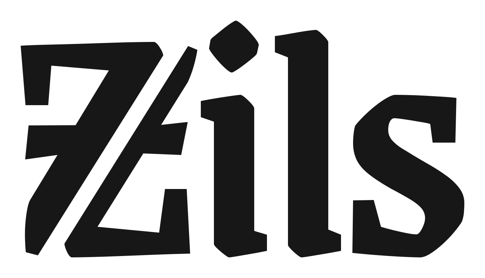

<h1 align="center">
  <a href="https://zils.ai">
    <picture>
      <source media="(prefers-color-scheme: dark)" srcset="docs/assets/zils-logo-dark.svg">
      <source media="(prefers-color-scheme: light)" srcset="docs/assets/zils-logo-light.svg">
      
    </picture>
  </a>
</h1>

**Miner and validator software for Zils decision-model training.**

Miners train candidate models. Validators verify their artifacts, calibrate
probabilities, evaluate held-out examples, and compute miner scores. This
repository contains those workers, their shared model and protocol contracts,
and the guarded Bittensor testnet integration.

## Start here

| Role | Guide |
| --- | --- |
| Run a JevK5 miner on NVIDIA hardware | [Queued miners](docs/queue-miners.md) |
| Run a JevK5 miner on Apple silicon | [Mac miners](docs/mac-miners.md) |
| Join the closed Bittensor testnet fleet | [Registration](docs/bittensor-registration.md), then [miner setup](docs/mining.md) |
| Run a validator | [Validator setup](docs/validators.md) |
| Develop or evaluate the subnet | [Local development](docs/development.md), [evaluation contract](docs/evaluation.md) |

Both workflows require operator admission. The customer training queue uses
JevK5 4B; the closed Bittensor fleet uses Kev 0.8B. Queue evaluation does not
publish chain weights. Mainnet participation and public miner discovery are
not implemented.

## Repository scope

| Repository | Owns |
| --- | --- |
| **zils** — this repository | Miners, validators, training, evaluation, model integrity, signed protocols, testnet weights |
| [zils-platform](https://github.com/ooo-hq/zils-platform) | Hosted APIs, account/billing logic, storage, database migrations, queue orchestration, serving |
| [zils-sdk](https://github.com/ooo-hq/zils-sdk) | Python/TypeScript clients, CLI, MCP |
| [zils-web](https://github.com/ooo-hq/zils-web) | Website, playground, customer dashboard |

Platform and SDK repositories may require organization access. Miner setup does
not require either repository, a payment SDK, or a Supabase service credential.
The platform uses this repository's evaluation code as a dependency. See
[repository boundaries](docs/repositories.md) for the split and migration details.

## Miner setup

Use [queued miner setup](docs/queue-miners.md) to create a verified JevK5 reference
and private hotkey configuration. Then, from this repository:

```sh
.venv-kev/bin/python -m miner.queue \
  --config .private/queue-miner.json --state .private/queue-miner \
  --reference models/jevk5-reference --device cuda
```

Use `--device mps` only on a [qualified Mac](docs/mac-miners.md). The miner uses
outbound HTTPS and receives only approved training data and signed upload URLs.
Keep calibration/test data and operator service credentials off miner accounts.
For the separate testnet fleet, run `./start-miner --rounds 1` from its assigned
bundle after completing the [fleet guide](docs/mining.md).

## Validator setup

Follow [validator setup](docs/validators.md) to configure the correct workflow.
A configured Bittensor validator evaluates one round with:

```sh
.venv-kev/bin/python -m zils.fleet validator \
  --config .private/testnet-fleet/validator/config.json --rounds 1
```

This previews weights without publishing. Chain submission remains a separate,
explicit step. Validators check model hashes, allowed tensors, calibration,
held-out quality, and registered identities. A valid training run can produce
`no_qualifying_model`; miners are not guaranteed acceptance.

The hosted queue processor lives in zils-platform and calls the same evaluation
code. Its deployment and database access are separate from miner installation.

## Setup

### Repository setup

For the Kev local/testnet fleet, install Git, Python 3.13, and `uv` on macOS,
Linux, or WSL 2:

```sh
git clone https://github.com/ooo-hq/zils.git
cd zils
uv venv --python 3.13 .venv-kev
uv pip install --python .venv-kev/bin/python \
  -r requirements/model.txt -r requirements/rehearsal.txt
.venv-kev/bin/python -m scripts.download_models
```

JevK5 operators should use the [JevK5 reference setup](docs/jevk5-queue.md#install-and-create-the-reference)
instead. References are downloaded from pinned upstream revisions. Private
checkpoints, wallets, datasets, and generated bundles are excluded from Git.

## Development

Install the [development dependencies](docs/development.md), then run:

```sh
make check
```

Checks exercise workers, signed submissions, evaluation, and testnet behavior
with local fixtures. They need no live chain or hosted account. Optional GPU
checks are explicitly gated. Node.js and hosted database services are not
needed for this repository's checks.

## Results and limits

The [first verified testnet round](docs/testnet-round-001.md) is recorded evidence,
not a statement of current subnet admission or uptime. [Experiment reports](docs/experiments.md)
and the [public JevBench comparison](docs/jevbench-public.md) preserve results,
including regressions. Synthetic fixture tests establish behavior, not model
quality, hostile-checkpoint isolation, or production capacity.

See [documentation](docs/README.md), [open milestones](docs/roadmap.md), and the
[public model page](https://zils.ai/model).
